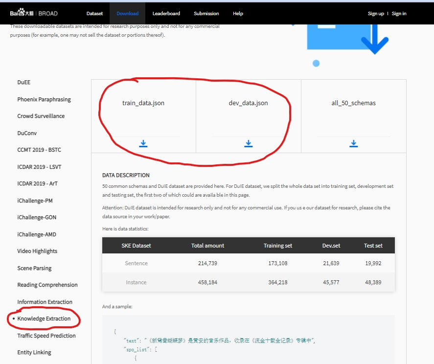
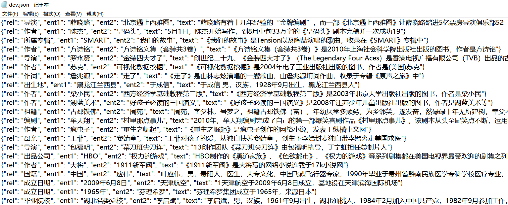
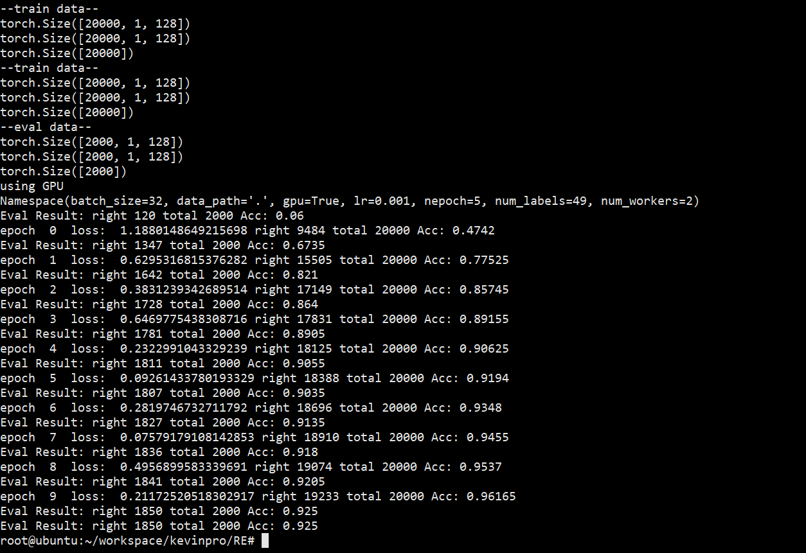
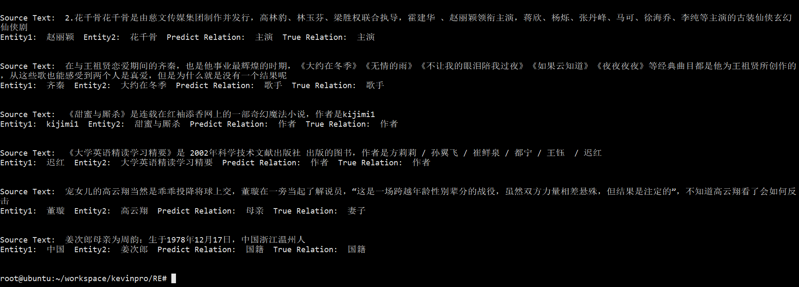

# Bert In Relation Extraction

大创所需，所以写了一个模型用来完成关系抽取（模型很简单，一拍脑袋想的然后就写了） **假如项目对你有用的话，欢迎Star ~~**

最后在百度DuIE数据集的完整测试集上达到95.37%正确率

**PS1：最近：我弄的一个自然语言处理仓库，用Pytorch实现了很多自然语言处理常用的任务，可以参考参考 https://github.com/Ricardokevins/Kevinpro-NLP-demo**

**PS2：我目前不再做关系抽取的相关工作，所以这个repo理论上不会增加新的feature了，但是有bug或者需要升级代码api可以在issue里留言，我会收到邮件并回复，请不要用私人联系方式**

# 效果：

```
Source Text:  《在夏天冬眠》是容祖儿演唱的一首歌曲，收录于专辑《独照》中
Entity1:  独照  Entity2:  在夏天冬眠  Predict Relation:  所属专辑  True Relation:  所属专辑


Source Text:  2.花千骨花千骨是由慈文传媒集团制作并发行，高林豹、林玉芬、梁胜权联合执导，霍建华 、赵丽颖领衔主演，蒋欣、杨烁、张丹峰、马可、徐海乔、李纯等主演的古装仙侠玄幻 仙侠剧
Entity1:  赵丽颖  Entity2:  花千骨  Predict Relation:  主演  True Relation:  主演


Source Text:  在与王祖贤恋爱期间的齐秦，也是他事业最辉煌的时期，《大约在冬季》《无情的雨》《不让我的眼泪陪我过夜》《如果云知道》《夜夜夜夜》等经典曲目都是他为王祖贤所创作的，从这些歌也能感受到两个人是真爱，但是为什么就是没有一个结果呢
Entity1:  齐秦  Entity2:  大约在冬季  Predict Relation:  歌手  True Relation:  歌手


Source Text:  《甜蜜与厮杀》是连载在红袖添香网上的一部奇幻魔法小说，作者是kijimi1
Entity1:  kijimi1  Entity2:  甜蜜与厮杀  Predict Relation:  作者  True Relation:  作者
```


# 使用方法

## 准备

1. 将DUIE文件路径放置于代码同目录（或者自己的数据，具体可见loader.py)，更加具体的获取和数据处理见下文

2. 将bert-base-chinese放置于同目录下的bert-base-chinese下或者自行指定位置
3. 安装pytorch，cuda，transformer，numpy等组件（实际测试可运行环境为**pytorch=1.5.1 transformers=2.5.1**)

## train and eval

（注意，在此之前，请做好数据的获取和预处理，步骤见文）

**python3 main.py**执行训练，并得到Fine-Tuing后的BERT

**python3 demo.py**得到样例输出，或自行阅读代码，修改test函数的传入参数内容即可自定义。


如果仅用于测试和实际使用，可以下载已经训练好的Model，然后调用demo.py下对应函数

**caculate_acc**：计算每一个类别的正确率

**demo_output**：随机选择样本，输出原文，实体对以及预测的关系，即实例输出


Model download（92.5%正确率的）

地址：https://pan.baidu.com/s/123qVcRa5SBKcMBLWxP5bKQ

提取码：bert

Model download（95.37%正确率的）

链接：https://pan.baidu.com/s/1ffOzN3FZ1foepB6NcSF5qQ 
提取码：bert

**PS：截至2021.12.18 模型被下载了300多次了，只有43个star...... QAQ**


# 数据

数据使用的是百度发布的DUIE数据，包含了实体识别和关系抽取

原数据地址：https://ai.baidu.com/broad/download?dataset=dureader

打开后在左侧栏选择knowledge extraction，然后如下界面点击下载train_data.json和dev_data.json，然后放到对应的位置

**运行loader.py里的prepare_data**，观察到目录里生成了**train.json和dev.json**

截止这里，数据的预处理完成了，可以运行main和demo




我对数据进行了预处理，提取关系抽取需要的部分

关系设定有49类，还是非常的丰富的

```
id2rel={0: 'UNK', 1: '主演', 2: '歌手', 3: '简称', 4: '总部地点', 5: '导演', 
        6: '出生地', 7: '目', 8: '出生日期', 9: '占地面积', 10: '上映时间',
        11: '出版社', 12: '作者', 13: '号', 14: '父亲', 15: '毕业院校', 
        16: '成立日期', 17: '改编自', 18: '主持人', 19: '所属专辑', 
        20: '连载网站', 21: '作词', 22: '作曲', 23: '创始人', 24: '丈夫', 
        25: '妻子', 26: '朝代', 27: '民族', 28: '国籍', 29: '身高', 30: '出品公司', 
        31: '母亲', 32: '编剧', 33: '首都', 34: '面积', 35: '祖籍', 36: '嘉宾', 
        37: '字', 38: '海拔', 39: '注册资本', 40: '制片人', 41: '董事长', 42: '所在城市',
        43: '气候', 44: '人口数量', 45: '邮政编码', 46: '主角', 47: '官方语言', 48: '修业年限'}   
    
```

数据的格式如下，ent1和ent2是实体，rel是关系




# Model

模型就是直接使用Bert用于序列分类的（BertEncoder+Fc+CrossEntropy）

具体的处理就是把ent1，ent2和sentence直接拼接送进模型

相对我之前对Bert的粗糙处理，这里加上了MASK-Attention一起送进模型


# Result

从百度的原数据中选择20000条，测试数据2000条（原数据相对很小的一部分）

训练参数：10 Epoch，0.001学习率，设置label共有49种（包含UNK，代表新关系和不存在关系）

然后在训练前和训练后的分别在测试数据上测试，可以看到**Fine-Tuing**高度有效

**测试集正确率达到 92.5%**


**修正：后来在所有的数据上训练和测试，测试数据36w，测试数据4w，eval正确率95+%**





# 实际测试

在数据中抽取一部分实际测试

效果不错





**2020.11.6：修复了demo.py里的Bug，无需bert-base-chinese依赖**

**2021.2.3 ：更新了demo.py，优化了结构**

**2021.2.4： 更新了readme关于数据获取部分的说明，上传和更新了第二次训练95%Acc的模型文件** 

**2021.3.6： 修改了模型的定义，更新了代码的结构**
